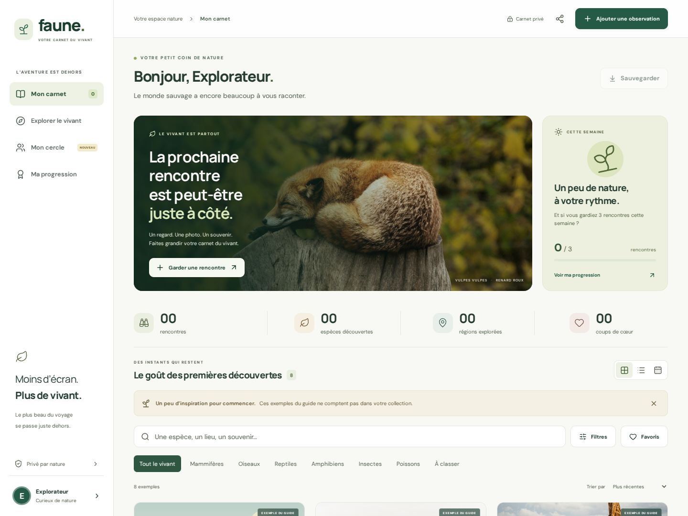

# faune. — Votre carnet du vivant

Un carnet de rencontres animales, un album à compléter et une façon de partager ses découvertes avec ses proches. Application française, installable, adaptée au téléphone et utilisable sans compte.

**[Ouvrir l’application](https://thithilacastagne.github.io/Pokedex-francois/)**



[Aperçu sur téléphone](docs/previews/mobile.png) · [Album des espèces](docs/previews/album.png) · [Collections de proches](docs/previews/circle.png)

## La version 2

- **Carnet** : ajout avec ou sans photo, identification libre, notes, favoris, vues grille/liste/chronologie, recherche sans accents et filtres combinables.
- **Explorer** : album de 18 espèces documentées, espèces rencontrées ou à découvrir, liste d’envies, carte régionale et arbre taxonomique. Les espèces identifiées librement comptent aussi dans la collection.
- **Progression** : statistiques personnelles, huit badges, calendrier de douze semaines et objectif hebdomadaire ajustable. Les exemples ne gonflent jamais les compteurs.
- **Collections de proches** : lien de partage, aperçu avant envoi, comparaison des espèces, enregistrement d’une collection reçue et carte PNG à télécharger. Cela fonctionne immédiatement, sans serveur de comptes.
- **Cercle connecté, en option** : petits groupes sur invitation, publications choisies, photos facultatives, encouragements, commentaires et modération. Nécessite de relier un projet Supabase : [guide d’activation](docs/CIRCLES_SETUP.md).
- **Votre espace** : pseudonyme, couleurs, sauvegarde/restauration, installation et réglages de conservation locale.
- **Hors ligne** : carnet et fiches disponibles après installation du cache ; mise à jour explicite sans effacer les observations.

## Partager avec ses proches

1. Dans **Votre espace**, choisir un pseudonyme.
2. Ajouter ses vraies observations au **Carnet**.
3. Ouvrir **Cercle → Partager ma collection**, vérifier l’aperçu, puis partager ou copier le lien.
4. Le destinataire ouvre le lien et peut conserver cette collection dans ses proches, sans importer les observations dans son carnet.

Le lien est un **instantané**, pas une synchronisation. Il contient uniquement le pseudonyme, une couleur, un identifiant de collection, une date de mise à jour, les compteurs et les identifiants des espèces du guide. Les notes, photos, lieux, dates d’observation et noms des espèces ajoutées librement en sont exclus. Toute personne possédant le lien peut le lire et le transférer ; il n’est ni chiffré ni révocable. Envoyer un nouveau lien pour actualiser sa collection.

## Données et confidentialité

Le carnet reste dans **IndexedDB, sur cet appareil et ce navigateur**. La version 2 conserve la base existante et le format de sauvegarde version 1. Il n’y a pas de synchronisation automatique des carnets entre appareils. Exporter une sauvegarde avant de changer de navigateur, d’appareil ou d’adresse, ou de supprimer les données du site.

La sauvegarde JSON inclut observations et photos, mais pas le profil, les envies ni les collections reçues. Elle n’est pas chiffrée. Toute personne ayant accès au même profil de navigateur peut consulter le carnet.

Le cercle connecté transmet seulement ce que l’utilisateur choisit de publier, ainsi que les données nécessaires au compte et à l’appartenance au cercle. Les notes, régions et dates d’observation ne sont pas copiées dans les publications. Une photo personnelle nécessite une sélection explicite. Les membres peuvent enregistrer ou transférer ce qu’ils voient. Supprimer une observation locale ne retire pas une publication déjà envoyée au cercle.

Photos locales : JPEG/PNG/WebP, 15 Mo par import, cinq photos par observation, réencodage à 1 800 pixels maximum sans métadonnées GPS. Les originaux restent inchangés. Le carnet est limité à 100 Mo. Convertir les fichiers HEIC avant import. Les photos partagées au cercle sont réduites à 720 pixels maximum.

Les coordonnées précises ne sont jamais conservées : la géolocalisation facultative suggère une grande région. Le fond de carte et les liens documentaires contactent des services externes. Les fiches sont éducatives, les identifications manuelles restent à vérifier et les statuts de conservation ne sont pas actualisés en temps réel. [Crédits des illustrations](public/photos/CREDITS.md).

## Développer

Prérequis : Node.js 24 et npm.

```sh
npm ci
npm run dev
```

Aucun fichier `.env` n’est nécessaire pour le carnet et le partage par lien. Pour le cercle connecté, suivre [CIRCLES_SETUP.md](docs/CIRCLES_SETUP.md). Ne jamais placer une clé secrète ou `service_role` dans une variable `VITE_*`.

## Vérifier

```sh
npm test
npm run test:db
npm run build
npx playwright install chromium
npm run test:browser
npm run test:a11y
npm run test:cloud
npm run format:check
```

Les scripts démarrent leur propre serveur de test sous `/Pokedex-francois/`. Aucun serveur de développement n’est requis. `CHROMIUM_PATH` et `CHROMIUM_ARGS` permettent d’utiliser un Chromium spécifique. Le test cloud emploie un projet fictif et intercepte ses requêtes : il n’envoie aucun email et ne publie rien sur un vrai service.

[Périmètre des vérifications et limites](docs/VERIFICATION.md).

## Publier et maintenir

La CI vérifie le code, les règles PostgreSQL, les parcours navigateur et l’accessibilité automatisée. GitHub Pages publie la branche `main`. La compilation produit `dist/` avec chemins relatifs et cache hors ligne versionné.

- [Déploiement et retour arrière](docs/DEPLOYMENT.md)
- [Activation des cercles privés](docs/CIRCLES_SETUP.md)
- [Nouveautés pour les utilisateurs](docs/RELEASE-v2.md)

## Repères dans le code

| Emplacement                                   | Rôle                                                 |
| --------------------------------------------- | ---------------------------------------------------- |
| `src/App.tsx`                                 | Navigation et orchestration des vues                 |
| `src/components/`                             | Carnet, album, progression, partage et cercle        |
| `src/storage.ts`                              | Validation, photos, sauvegardes et IndexedDB         |
| `src/collection.ts`                           | Déduplication des espèces, statistiques et badges    |
| `src/sharing.ts`                              | Format strict des liens et comparaisons              |
| `src/cloud.ts`                                | Accès au service facultatif des cercles              |
| `supabase/migrations/001_private_circles.sql` | Schéma, droits, invitations et isolation des cercles |
| `src/data.ts`                                 | Fiches et régions                                    |
| `scripts/`                                    | Cache hors ligne et essais reproductibles            |
